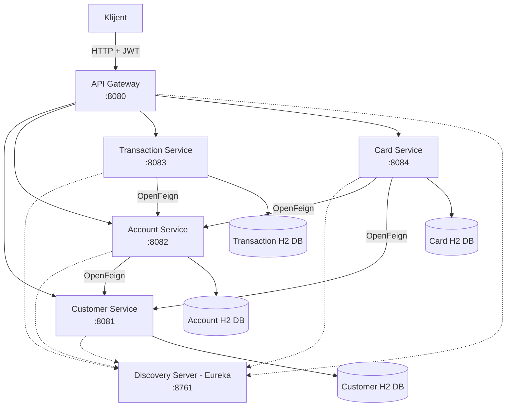
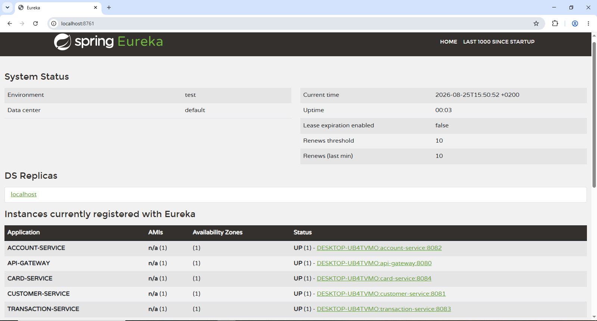
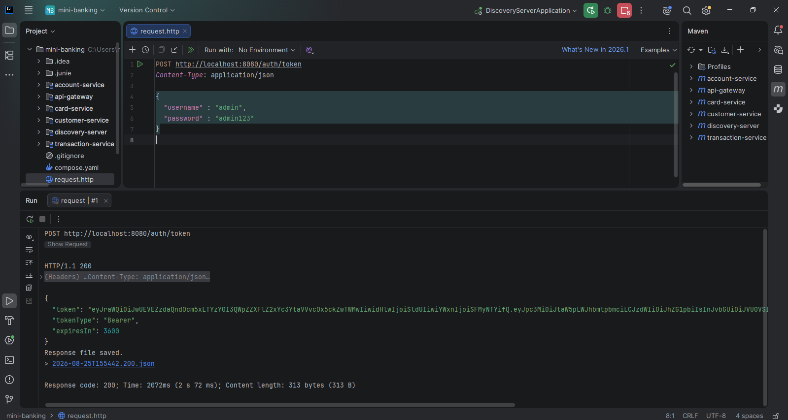
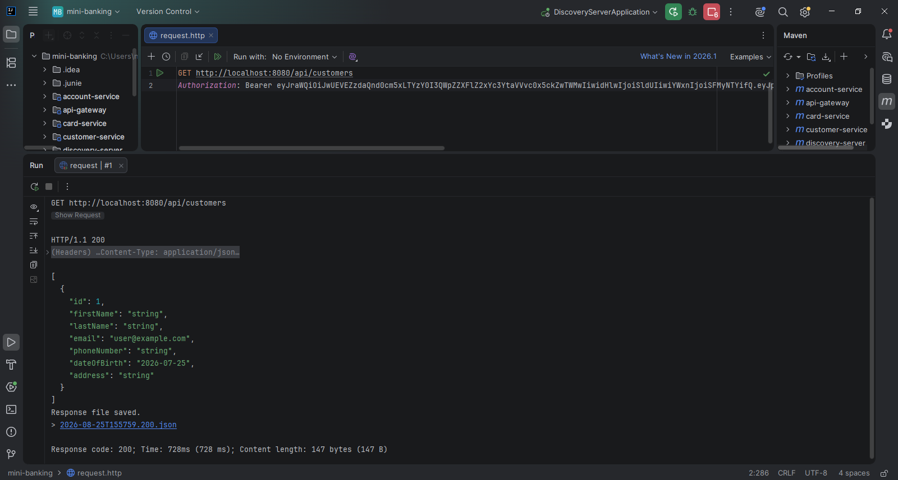
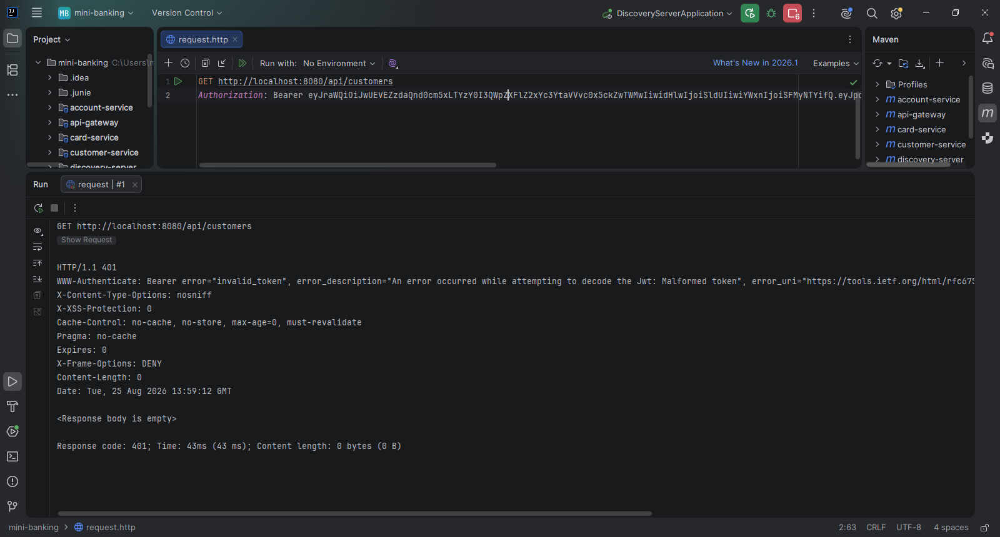
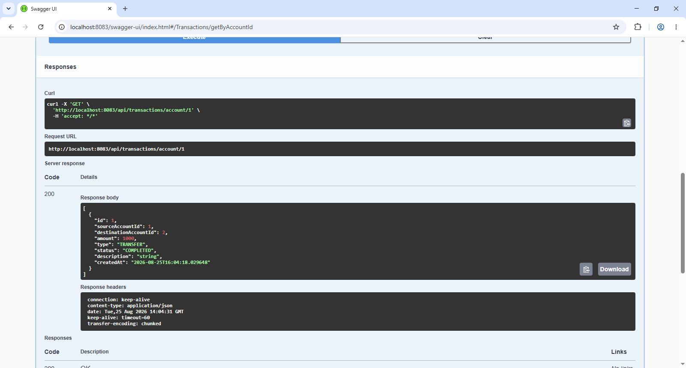
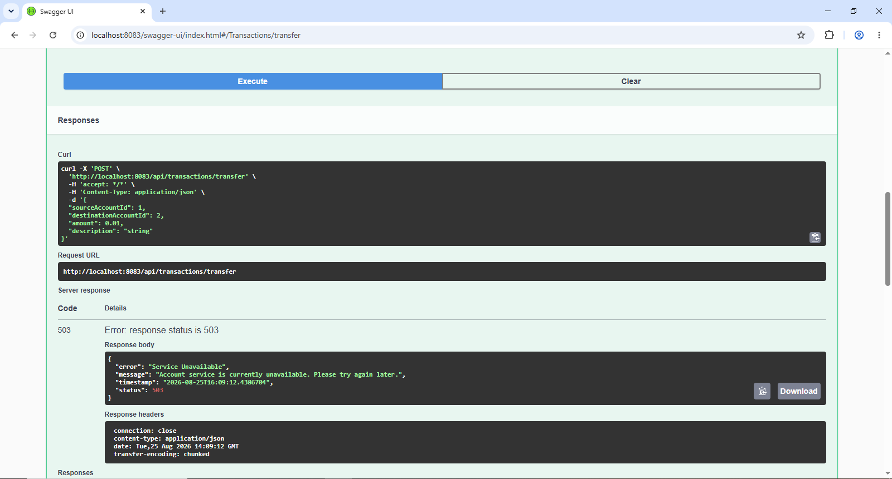
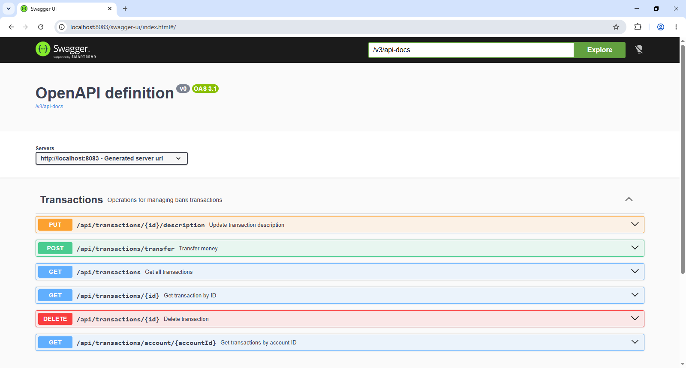
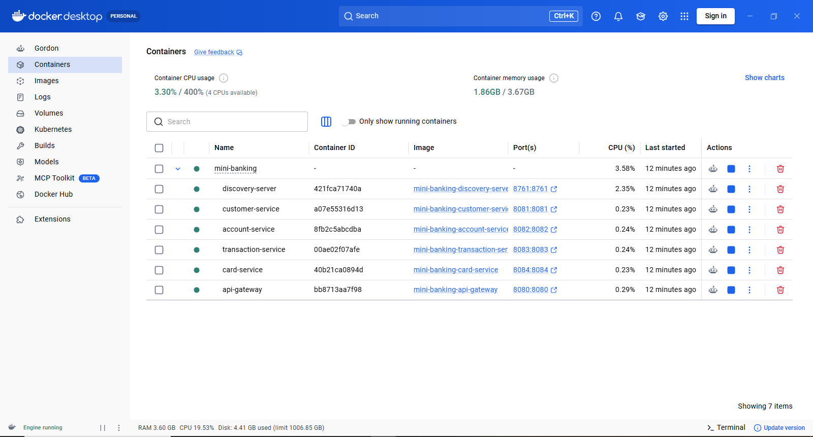

# Mini Banking

Mini Banking je mikroservisna aplikacija koja simulira osnovne funkcionalnosti bankarskog sistema.

Sistem je razvijen korišćenjem **Spring Boot** i **Spring Cloud** tehnologija i sastoji se od više nezavisnih mikroservisa koji međusobno komuniciraju preko REST API-ja i OpenFeign klijenata.

Aplikacija podržava upravljanje korisnicima, računima, transakcijama i karticama, uz Service Discovery, API Gateway, JWT autentifikaciju, mehanizme otpornosti na greške i kontejnerizaciju pomoću Docker-a.

---


## Arhitektura sistema

Aplikacija je organizovana prema mikroservisnoj arhitekturi.



Klijent pristupa sistemu preko **API Gateway-a** na portu `8080`. Gateway koristi Eureka Service Discovery kako bi pronašao odgovarajuće instance mikroservisa i prosledio im zahteve.

Svaki poslovni mikroservis poseduje sopstvenu H2 bazu podataka i ne pristupa direktno bazama drugih servisa.

---

## Mikroservisi

| Servis | Port | Namena |
|---|---:|---|
| Discovery Server | `8761` | Eureka Service Discovery |
| API Gateway | `8080` | Jedinstvena ulazna tačka i JWT zaštita |
| Customer Service | `8081` | Upravljanje korisnicima |
| Account Service | `8082` | Upravljanje bankovnim računima |
| Transaction Service | `8083` | Upravljanje transferima i transakcijama |
| Card Service | `8084` | Upravljanje bankovnim karticama |

---

## Korišćene tehnologije

Projekat koristi:

- Java 17
- Spring Boot 4.0.7
- Spring Cloud 2025.1.2
- Spring Web MVC
- Spring Data JPA
- Spring Validation
- Spring Cloud Netflix Eureka
- Spring Cloud OpenFeign
- Spring Cloud Gateway
- Spring Cloud LoadBalancer
- Resilience4j
- JWT autentifikaciju
- Spring Boot Actuator
- Springdoc OpenAPI / Swagger UI
- H2 Database
- Maven
- Docker
- Docker Compose

---

# Struktura projekta

```text
mini-banking/
│
├── discovery-server/
├── api-gateway/
├── customer-service/
├── account-service/
├── transaction-service/
├── card-service/
│
├── docs/
│   └── images/
│       ├── docker-compose.png
│       ├── eureka-dashboard.png
│       ├── jwt-authorized.png
│       ├── jwt-token.png
│       ├── jwt-unauthorized.png
│       ├── resilience4j-fallback.png
│       ├── transaction-swagger.png
│       └── transactions-by-account.png
│
├── compose.yaml
├── .gitignore
└── README.md
```

Svaki mikroservis predstavlja zasebnu Spring Boot aplikaciju sa sopstvenim `pom.xml`, konfiguracijom, poslovnom logikom i Dockerfile-om.

---

# Discovery Server — Eureka

`discovery-server` predstavlja centralni **Service Registry** sistema.

Poslovni servisi i API Gateway se prilikom pokretanja registruju kod Eureka servera. Na taj način servisi mogu da komuniciraju korišćenjem njihovih imena umesto hardkodovanih IP adresa i portova.

Eureka Dashboard:

```text
http://localhost:8761
```

Na dashboard-u se mogu videti registrovane instance:

- `API-GATEWAY`
- `CUSTOMER-SERVICE`
- `ACCOUNT-SERVICE`
- `TRANSACTION-SERVICE`
- `CARD-SERVICE`



---

# API Gateway

API Gateway predstavlja jedinstvenu ulaznu tačku u sistem.

Dostupan je na:

```text
http://localhost:8080
```

Gateway prosleđuje zahteve odgovarajućim mikroservisima koristeći Eureka Service Discovery i `lb://` rute.

| Putanja | Servis |
|---|---|
| `/api/customers/**` | `customer-service` |
| `/api/accounts/**` | `account-service` |
| `/api/transactions/**` | `transaction-service` |
| `/api/cards/**` | `card-service` |

Na primer:

```text
GET http://localhost:8080/api/customers/1
```

Gateway pronalazi instancu `customer-service` preko Eureke i prosleđuje joj zahtev.

---

# JWT autentifikacija

API Gateway implementira JWT autentifikaciju kao dodatnu tehnologiju projekta.

Endpoint za generisanje tokena je:

```text
POST /auth/token
```

Primer zahteva:

```json
{
  "username": "admin",
  "password": "admin123"
}
```

Uspešan zahtev vraća JWT:



Dobijeni token šalje se prilikom pristupa zaštićenim `/api/**` endpointima:

```text
Authorization: Bearer <JWT_TOKEN>
```

Primer uspešnog pristupa Customer Service-u preko API Gateway-a:



Ukoliko token nedostaje, nije validan ili je izmenjen, Gateway odbija zahtev.

Primer zahteva sa nevalidnim tokenom:



Na ovaj način se autentifikacija obavlja centralizovano na API Gateway-u, pre prosleđivanja zahteva poslovnim servisima.

> `admin/admin123` predstavlja demo kredencijale namenjene lokalnom testiranju projekta.

---

# Customer Service

Customer Service upravlja korisnicima bankarskog sistema.

Osnovna putanja:

```text
/api/customers
```

Podržane su CRUD operacije za:

- kreiranje korisnika,
- prikaz svih korisnika,
- prikaz korisnika po ID-u,
- ažuriranje korisnika,
- brisanje korisnika.

Primer:

```text
POST   /api/customers
GET    /api/customers
GET    /api/customers/{id}
PUT    /api/customers/{id}
DELETE /api/customers/{id}
```

Customer Service koristi sopstvenu H2 bazu podataka.

---

# Account Service

Account Service upravlja bankovnim računima.

Osnovna putanja:

```text
/api/accounts
```

Account je povezan sa korisnikom preko `customerId`.

Pre kreiranja računa, Account Service preko OpenFeign klijenta komunicira sa Customer Service-om kako bi proverio da li navedeni korisnik postoji.

Servis podržava operacije kao što su:

```text
POST   /api/accounts
GET    /api/accounts
GET    /api/accounts/{id}
GET    /api/accounts/customer/{customerId}
POST   /api/accounts/{id}/deposit
POST   /api/accounts/{id}/withdraw
PUT    /api/accounts/{id}/status
DELETE /api/accounts/{id}
```

---

## Agregacioni endpoint

Account Service poseduje agregacioni endpoint:

```text
GET /api/accounts/{id}/details
```

Ovaj endpoint kombinuje podatke iz:

- Account Service-a
- Customer Service-a

Tok zahteva:

```text
Klijent
   |
   v
Account Service
   |
   | OpenFeign
   v
Customer Service
   |
   v
Account + Customer podaci
```

Time se demonstrira međuservisna komunikacija i agregacija podataka bez direktnog pristupa tuđoj bazi.

---

# Transaction Service

Transaction Service upravlja transferima i evidencijom transakcija.

Osnovna putanja:

```text
/api/transactions
```

Najvažniji endpoint je:

```text
POST /api/transactions/transfer
```

Prilikom transfera Transaction Service komunicira sa Account Service-om preko OpenFeign-a.

Servis takođe podržava CRUD operacije nad evidencijom transakcija:

```text
POST   /api/transactions/transfer
GET    /api/transactions
GET    /api/transactions/{id}
GET    /api/transactions/account/{accountId}
PUT    /api/transactions/{id}/description
DELETE /api/transactions/{id}
```

Primer uspešnog dobijanja transakcija povezanih sa određenim računom:



---

# OpenFeign komunikacija

Za komunikaciju između mikroservisa koristi se **Spring Cloud OpenFeign**.

Feign omogućava deklarativno definisanje HTTP klijenata.

U projektu se koristi za komunikaciju između servisa, između ostalog:

```text
Account Service
      |
      v
Customer Service
```

```text
Transaction Service
      |
      v
Account Service
```

```text
Card Service
      |
      +------> Account Service
      |
      +------> Customer Service
```

Servisi se pronalaze preko Eureka Service Discovery-ja, zbog čega nije potrebno hardkodovati njihove konkretne adrese.

---

# Resilience4j

Transaction Service implementira mehanizme otpornosti na greške prilikom komunikacije sa Account Service-om.

Korišćeni su:

- Retry
- Circuit Breaker
- Fallback

## Retry

Ukoliko poziv ka Account Service-u ne uspe, Retry omogućava ponovno pokušavanje operacije prema definisanoj konfiguraciji.

Konfigurisan je ograničen broj pokušaja sa vremenskim razmakom između pokušaja.

## Circuit Breaker

Circuit Breaker prati neuspešne pozive ka Account Service-u.

U slučaju većeg broja neuspeha može privremeno prekinuti dalje pokušaje pozivanja nedostupnog servisa, čime se sprečava nepotrebno opterećenje sistema.

## Fallback

Kada Account Service nije dostupan i komunikacija ne može uspešno da se izvrši, aktivira se fallback mehanizam.

Umesto nekontrolisane greške, klijent dobija kontrolisan odgovor:

```text
503 Service Unavailable
```

Primer je testiran tako što je `account-service` ugašen, nakon čega je pokušan novi transfer:



Ovaj test pokazuje da pad jednog mikroservisa ne dovodi do nekontrolisanog pada Transaction Service-a.

---

# Card Service

Card Service upravlja bankovnim karticama.

Osnovna putanja:

```text
/api/cards
```

Prilikom kreiranja kartice klijent prosleđuje Account ID i tip kartice.

Card Service zatim preko međuservisne komunikacije dobavlja potrebne podatke o računu i vlasniku računa.

Primer endpointa:

```text
POST   /api/cards
GET    /api/cards
GET    /api/cards/{id}
GET    /api/cards/account/{accountId}
PUT    /api/cards/{id}/block
DELETE /api/cards/{id}
```

Na taj način Card Service ne zahteva da klijent ručno prosleđuje podatke o vlasniku koji već postoje u sistemu.

---

# Swagger / OpenAPI

REST API dokumentacija implementirana je pomoću Springdoc OpenAPI i Swagger UI-ja.

Controller endpointi dokumentovani su pomoću anotacija kao što su:

```java
@Tag
@Operation
@ApiResponse
```

Primer Swagger dokumentacije za Transaction Service:



Swagger UI omogućava pregled i interaktivno testiranje REST endpointa.

Swagger dokumentacija business servisa dostupna je na odgovarajućim portovima, na primer:

```text
http://localhost:8081/swagger-ui/index.html
http://localhost:8082/swagger-ui/index.html
http://localhost:8083/swagger-ui/index.html
http://localhost:8084/swagger-ui/index.html
```

---

# Spring Boot Actuator

Actuator je uključen radi praćenja stanja aplikacija.

Izloženi su endpointi:

```text
/actuator/health
/actuator/info
/actuator/metrics
```

Primer za Transaction Service:

```text
http://localhost:8083/actuator/health
```

Health endpoint omogućava jednostavnu proveru da li je servis pokrenut i dostupan.

---

# H2 baze podataka

Svaki poslovni mikroservis koristi sopstvenu H2 bazu.

Primer organizacije:

```text
Customer Service     -> customerdb
Account Service      -> accountdb
Transaction Service  -> transactiondb
Card Service         -> carddb
```

Ovo prati princip mikroservisne arhitekture prema kome servis poseduje svoje podatke.

Jedan servis ne pristupa direktno tabelama drugog servisa. Kada su mu potrebni podaci iz drugog domena, koristi njegov REST API.

Baze su konfigurisane kao **in-memory H2 baze**, pa se podaci ponovo inicijalizuju/gube nakon gašenja odgovarajuće aplikacije ili kontejnera.

---

# Docker i Docker Compose

Docker predstavlja drugu dodatnu tehnologiju implementiranu u projektu.

Svaka Spring Boot aplikacija poseduje sopstveni:

```text
Dockerfile
```

U root direktorijumu projekta nalazi se:

```text
compose.yaml
```

koji omogućava podizanje kompletnog sistema jednom komandom.

Pokretanje:

```bash
docker compose up --build
```

Nakon što su image-i već izgrađeni:

```bash
docker compose up
```

Zaustavljanje:

```bash
docker compose down
```

Docker Compose podiže:

- Discovery Server
- API Gateway
- Customer Service
- Account Service
- Transaction Service
- Card Service



Unutar Docker mreže servisi komuniciraju korišćenjem naziva Compose servisa.

Na primer, Eureka je dostupna ostalim kontejnerima preko:

```text
http://discovery-server:8761/eureka/
```

umesto preko `localhost`.

---

# Pokretanje projekta lokalno

## Preduslovi

Za lokalno pokretanje potrebni su:

- JDK 17
- Maven
- IntelliJ IDEA ili drugi Java IDE

## Redosled pokretanja

Preporučeni redosled je:

```text
1. discovery-server
2. customer-service
3. account-service
4. transaction-service
5. card-service
6. api-gateway
```

Nakon pokretanja proveriti Eureka Dashboard:

```text
http://localhost:8761
```

Svi servisi treba da budu registrovani sa statusom `UP`.

---

# Pokretanje pomoću Docker Compose-a

Potrebno je imati instaliran i pokrenut Docker Desktop.

Iz root direktorijuma projekta:

```bash
docker compose up --build
```

Nakon uspešnog build-a sistem je dostupan na istim portovima kao pri lokalnom pokretanju.

Za proveru kontejnera može se koristiti:

```bash
docker compose ps
```

Za gašenje:

```bash
docker compose down
```

---

# Primer testiranja sistema

Jedan mogući end-to-end scenario je:

### 1. Pokrenuti sistem

Pokrenuti svih šest aplikacija lokalno ili pomoću Docker Compose-a.

### 2. Proveriti Eureku

Otvoriti:

```text
http://localhost:8761
```

i proveriti da su servisi registrovani.

### 3. Dobiti JWT token

```text
POST http://localhost:8080/auth/token
```

```json
{
  "username": "admin",
  "password": "admin123"
}
```

### 4. Koristiti token

Za naredne zahteve kroz Gateway dodati:

```text
Authorization: Bearer <JWT_TOKEN>
```

### 5. Kreirati korisnika

```text
POST http://localhost:8080/api/customers
```

### 6. Kreirati račun

```text
POST http://localhost:8080/api/accounts
```

Account Service proverava postojanje Customer-a preko Feign-a.

### 7. Kreirati drugi račun i izvršiti transfer

```text
POST http://localhost:8080/api/transactions/transfer
```

Transaction Service komunicira sa Account Service-om.

### 8. Kreirati karticu

```text
POST http://localhost:8080/api/cards
```

Card Service dobavlja potrebne Account/Customer podatke.

### 9. Testirati agregaciju

```text
GET http://localhost:8080/api/accounts/{id}/details
```

Dobija se odgovor sastavljen od podataka iz više mikroservisa.

### 10. Testirati otpornost sistema

Ugasiti Account Service i pokušati novi transfer.

Očekivani rezultat:

```text
503 Service Unavailable
```

Time se demonstriraju Retry, Circuit Breaker i Fallback mehanizmi.

---

# HTTP status kodovi

API koristi odgovarajuće HTTP status kodove, između ostalog:

| Status | Značenje |
|---:|---|
| `200 OK` | Zahtev uspešno izvršen |
| `201 Created` | Resurs uspešno kreiran |
| `204 No Content` | Resurs uspešno obrisan |
| `400 Bad Request` | Neispravan zahtev / validacija |
| `401 Unauthorized` | JWT autentifikacija nije uspešna |
| `404 Not Found` | Traženi resurs ne postoji |
| `409 Conflict` | Operacija nije dozvoljena zbog trenutnog stanja |
| `503 Service Unavailable` | Zavisni mikroservis trenutno nije dostupan |

---

# Ključni koncepti projekta

Projekat demonstrira sledeće koncepte mikroservisne arhitekture:

**Service Discovery** — Eureka omogućava dinamičko pronalaženje servisa.

**API Gateway** — predstavlja centralnu ulaznu tačku za klijentske zahteve.

**Database per Service** — svaki poslovni servis poseduje sopstvenu bazu.

**REST API** — servisi izlažu funkcionalnosti preko HTTP endpointa.

**DTO** — objekti za razmenu podataka odvojeni su od JPA entiteta.

**OpenFeign** — omogućava deklarativnu komunikaciju između mikroservisa.

**Load Balancing** — zahtevi se usmeravaju ka registrovanim instancama servisa.

**Retry** — neuspešan poziv može biti automatski ponovljen.

**Circuit Breaker** — sprečava konstantno pozivanje nedostupnog servisa.

**Fallback** — omogućava kontrolisano ponašanje kada zavisni servis nije dostupan.

**JWT** — štiti API rute na nivou Gateway-a.

**Swagger/OpenAPI** — dokumentuje REST API.

**Actuator** — omogućava praćenje health-a i metrika servisa.

**Docker Compose** — omogućava kontejnerizovano pokretanje kompletnog sistema.

---

# Zaključak

Mini Banking projekat predstavlja mikroservisni bankarski sistem razvijen korišćenjem Spring Boot i Spring Cloud ekosistema.

Aplikacija demonstrira razdvajanje poslovnih domena na nezavisne servise, međuservisnu komunikaciju, Service Discovery, API Gateway, autentifikaciju, agregaciju podataka, otpornost na greške, API dokumentaciju, monitoring i kontejnerizaciju.

Sistem se može pokrenuti pojedinačnim pokretanjem Spring Boot aplikacija ili kao celina pomoću Docker Compose-a.

---

## Autor

**Andrija Nikolić**  
**Broj indeksa:** 86/2023