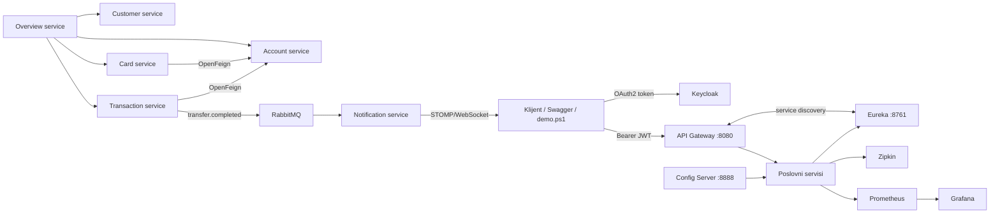

# MiniBanking

MiniBanking je fakultetski projekat distribuiranog bankarskog sistema razvijen u Javi 21, Spring Boot-u i Spring Cloud-u. Sistem ima devet izvršnih aplikacija, centralizovanu konfiguraciju, service discovery, API Gateway, sinhronu i asinhronu međuservisnu komunikaciju, JWT zaštitu, otpornost na greške i kompletan observability sloj.

## Arhitektura



Svaki servis poseduje svoju H2 bazu i ne pristupa tabelama drugog servisa. Javni REST saobraćaj ide kroz Gateway. `transaction-service` orkestrira transfer preko `account-service`, dok `overview-service` gradi složen prikaz podataka iz četiri servisa i vraća parcijalan odgovor kada neki od njih nije dostupan.

## Tehnologije

- Java 21, Maven Wrapper i Spring Boot 4.1.0
- Spring Cloud 2025.1.2: Config, Eureka, Gateway, LoadBalancer i OpenFeign
- Spring Data JPA, Hibernate, H2 i Bean Validation
- Resilience4j Circuit Breaker i Retry sa fallback odgovorima
- RabbitMQ sa retry/DLQ pravilima i idempotentnim consumer-om
- Spring Security Resource Server, OAuth 2.0/OIDC, JWT i Keycloak 26.7.0
- Springdoc OpenAPI 3.0.3 i Swagger UI
- Actuator, Micrometer, Prometheus, Grafana i Zipkin
- WebSocket/STOMP obaveštenja
- Docker, Docker Compose i multi-stage Dockerfile-ovi
- JUnit 5, Spring Boot Test, Mockito i Testcontainers

## Moduli

| Grupa | Modul | Odgovornost |
|---|---|---|
| infrastruktura | `discovery-server` | Eureka registar instanci |
| infrastruktura | `config-server` | centralna YAML konfiguracija iz `config-repository` |
| infrastruktura | `api-gateway` | rutiranje `lb://`, JWT autentikacija i RBAC |
| poslovni servis | `customer-service` | CRUD životnog ciklusa klijenta |
| poslovni servis | `account-service` | CRUD računa, uplate, isplate i atomski transfer |
| poslovni servis | `transaction-service` | audit i orkestracija transfera |
| poslovni servis | `card-service` | tokenizovan životni ciklus kartice |
| poslovni servis | `notification-service` | trajna i WebSocket obaveštenja |
| kompozicioni servis | `overview-service` | otporna agregacija podataka iz više servisa |

## Najbrže pokretanje — Docker Compose

Preduslovi su Docker Desktop sa uključenim Linux containers režimom i najmanje oko 4 GB memorije dodeljene Docker-u. Java nije potrebna za ovaj način pokretanja.

Iz korena repozitorijuma pokreni osnovni sistem:

```powershell
docker compose up --build -d
docker compose ps
```

Prvo građenje preuzima Maven i Docker zavisnosti i zato može trajati nekoliko minuta. Sačekaj da Java servisi dobiju status `healthy`. Logove možeš pratiti ovako:

```powershell
docker compose logs -f discovery-server config-server api-gateway
```

Za punu demonstraciju, sa dve `overview-service` instance i monitoringom, koristi profile:

```powershell
docker compose --profile scale --profile observability up --build -d
```

Automatizovan kompletan poslovni scenario pokreće se jednom komandom:

```powershell
.\scripts\demo.ps1
```

Skripta čeka Gateway i Keycloak, pribavlja JWT, kreira dva klijenta i dva računa, izdaje karticu, izvršava transfer, ponavlja isti zahtev radi dokaza idempotentnosti, čita agregirani pregled i proverava RabbitMQ obaveštenja.

Zaustavljanje bez brisanja podataka iz Docker volume-a:

```powershell
docker compose --profile scale --profile observability down
```

`docker compose down -v` briše RabbitMQ, Prometheus i Grafana volume-e; koristi ga samo kada zaista želiš potpuno čist sistem.

## JWT token i ručni API poziv

Demo nalog ima samo ulogu `CUSTOMER`; administratorski nalog ima `ADMIN` i `CUSTOMER`. Password grant ovde služi samo jednostavnoj lokalnoj demonstraciji, ne kao preporuka za produkciju.

```powershell
$tokenResponse = Invoke-RestMethod -Method Post `
  -Uri "http://localhost:9090/realms/minibanking/protocol/openid-connect/token" `
  -ContentType "application/x-www-form-urlencoded" `
  -Body @{
    client_id  = "minibanking-cli"
    grant_type = "password"
    username   = "customer"
    password   = "customer123"
  }

$headers = @{ Authorization = "Bearer $($tokenResponse.access_token)" }
Invoke-RestMethod -Uri "http://localhost:8080/api/customers" -Headers $headers
```

Gateway vraća `401 Unauthorized` bez validnog tokena. `DELETE /api/**` dodatno zahteva ulogu `ADMIN` i za običnog korisnika vraća `403 Forbidden`.

## Portovi i korisnički interfejsi

| Port | Komponenta | Adresa / napomena |
|---:|---|---|
| 8080 | API Gateway | `http://localhost:8080` |
| 8081 | Customer | `http://localhost:8081/swagger-ui.html` |
| 8082 | Account | `http://localhost:8082/swagger-ui.html` |
| 8083 | Transaction | `http://localhost:8083/swagger-ui.html` |
| 8084 | Card | `http://localhost:8084/swagger-ui.html` |
| 8085 | Notification | `http://localhost:8085/swagger-ui.html`, WebSocket `/ws` |
| 8086 | Overview instanca 1 | `http://localhost:8086/swagger-ui.html` |
| 8087 | Overview instanca 2 | aktivna sa profilom `scale` |
| 8761 | Eureka | `http://localhost:8761` |
| 8888 | Config Server | npr. `http://localhost:8888/customer-service/docker` |
| 9090 | Keycloak | `http://localhost:9090` |
| 5672 | RabbitMQ | AMQP |
| 15672 | RabbitMQ Management | `http://localhost:15672` |
| 9411 | Zipkin | `http://localhost:9411` |
| 9091 | Prometheus | `http://localhost:9091`, profil `observability` |
| 3000 | Grafana | `http://localhost:3000`, profil `observability` |

Lokalni demo kredencijali:

| Sistem | Korisnik | Lozinka |
|---|---|---|
| MiniBanking CUSTOMER | `customer` | `customer123` |
| MiniBanking ADMIN | `admin` | `admin123` |
| Keycloak administrator | `admin` | `admin123` |
| RabbitMQ | `minibanking` | `minibanking-secret` |
| Grafana | `admin` | `admin123` |

Ovi nalozi i lozinke su namerno javni demo podaci i ne smeju se koristiti u produkciji.

Swagger se otvara direktno na portu svakog poslovnog servisa. To omogućava pregled svih endpoint-a bez obzira na Gateway rute. U produkcionoj varijanti direktni portovi ne bi bili javno izloženi; Gateway bi ostao jedina spoljašnja ulazna tačka.

## Provera ključnih infrastrukturnih zahteva

- Centralna konfiguracija: otvori `http://localhost:8080/api/customers/welcome` bez tokena i proveri polje `configurationSource`.
- Service discovery: u Eureka UI proveri osam registrovanih aplikacija; sam Eureka server se namerno ne registruje kao klijent.
- Load balancing: uz profil `scale` više puta pozovi `http://localhost:8080/api/overview/instance`; smenjuju se `overview-1` i `overview-2`.
- Circuit breaker/fallback: zaustavi `card-service`, pozovi customer overview i proveri `degradedServices`, pa servis ponovo pokreni.
- Async komunikacija: izvrši transfer, zatim proveri `notification-service` i RabbitMQ queue `minibanking.notifications`.
- Tracing: u Zipkin-u izaberi `api-gateway` i pronađi trace za overview ili transfer.
- Metrike: u Prometheus-u proveri `minibanking_transfer_attempts_total`; Grafana dashboard se automatski provision-uje.
- RBAC: CUSTOMER može da čita i menja podatke, ali samo ADMIN može da šalje `DELETE` kroz Gateway.

Primer load-balancing provere:

```powershell
1..6 | ForEach-Object {
  Invoke-RestMethod "http://localhost:8080/api/overview/instance"
}
```

Primer kontrolisanog fallback-a:

```powershell
docker compose stop card-service
# Zatim pozovi /api/overview/customers/{customerId} sa Bearer tokenom.
docker compose start card-service
```

## Lokalno pokretanje iz IDE-a ili Maven-a

Potrebni su JDK 21 i Docker Desktop. RabbitMQ, Keycloak i Zipkin najlakše je ostaviti u kontejnerima:

```powershell
docker compose up -d rabbitmq keycloak zipkin
```

Svaku narednu komandu pokreni u posebnom PowerShell terminalu, navedenim redosledom:

```powershell
.\mvnw.cmd -pl infrastructure/discovery-server spring-boot:run
.\mvnw.cmd -pl infrastructure/config-server spring-boot:run
.\mvnw.cmd -pl services/customer-service spring-boot:run
.\mvnw.cmd -pl services/account-service spring-boot:run
.\mvnw.cmd -pl services/transaction-service spring-boot:run
.\mvnw.cmd -pl services/card-service spring-boot:run
.\mvnw.cmd -pl services/notification-service spring-boot:run
.\mvnw.cmd -pl services/overview-service spring-boot:run
.\mvnw.cmd -pl infrastructure/api-gateway spring-boot:run
```

U terminalima za `transaction-service` i `notification-service` prvo postavi Compose kredencijale:

```powershell
$env:RABBITMQ_USERNAME = "minibanking"
$env:RABBITMQ_PASSWORD = "minibanking-secret"
```

Ako Config Server pokrećeš iz IDE-a sa drugim working directory-jem, podesi `CONFIG_REPOSITORY_LOCATION` na apsolutnu `config-repository` putanju.

## Baze i trajnost

Poslovni servisi koriste odvojene in-memory H2 baze: `customerdb`, `accountdb`, `transactiondb`, `carddb` i `notificationdb`. H2 konzola je na `/h2-console` direktnog porta servisa; korisnik je `sa`, a lozinka prazna. Podaci se namerno resetuju pri ponovnom pokretanju servisa jer zadatak traži H2 demonstraciono okruženje. Za produkciju bi svaki servis dobio zasebnu trajnu bazu i Flyway migracije.

## Testovi

Za pun test cele Maven reactor strukture:

```powershell
.\mvnw.cmd -B -ntp test
```

Docker Desktop mora biti pokrenut jer `RabbitNotificationEndToEndTests` podiže pravi RabbitMQ kontejner preko Testcontainers-a. Trenutni paket ima 22 testa: unit, Spring integration i Testcontainers E2E; svi prolaze bez failure-a, error-a i skip-a.

Za test samo jednog modula:

```powershell
.\mvnw.cmd -B -ntp -pl services/account-service test
```

## Pokrivenost zahteva projekta

| Zahtev | Implementacija |
|---|---|
| Eureka i dinamičko otkrivanje | svi servisi se registruju po `spring.application.name` |
| Gateway YAML i `lb://` | šest Gateway ruta koristi service name, bez fiksnih adresa |
| LoadBalancer | dve Overview instance iza iste Eureka registracije |
| OpenFeign | Transaction → Account, Card → Account, Overview → četiri servisa |
| Circuit Breaker, Retry i fallback | četiri imenovane Resilience4j instance, centralni pragovi i parcijalni odgovor |
| CRUD, validacija, JPA i H2 | svi domenski servisi imaju REST sloj, DTO validaciju, JPA i svoju bazu |
| najmanje dve multi-service operacije | transfer, izdavanje kartice i dve agregacije |
| Actuator i Swagger | health/info/metrics/prometheus i OpenAPI na poslovnim servisima |
| Config Server | native centralni repozitorijum sa default/docker/production profilima |
| RabbitMQ | domain event posle DB commita, exchange/queue/DLQ, retry i deduplikacija |
| Docker Compose | cela platforma, healthcheck-ovi, mreža, volume-i i profili |
| JWT Gateway zaštita | Keycloak realm, validacija potpisa/issuer-a i CUSTOMER/ADMIN uloge |
| bonus funkcionalnosti | Zipkin, Prometheus/Grafana, skaliranje, WebSocket, profili, ProblemDetail i Testcontainers |

## Važne projektne odluke

- Novac je `BigDecimal`, nikada `double`, da se izbegnu greške binarne pokretne tačke.
- Transfer zaključava oba računa pesimistički i u stabilnom UUID redosledu radi zaštite od race condition-a i deadlock-a.
- Idempotency key sprečava duplo skidanje novca pri retry-u.
- Rabbit događaj se objavljuje tek posle uspešnog DB commita, a consumer ima jedinstveni `eventId`.
- Kartica čuva token i maskirani PAN, ne čuva pravi PAN ni CVV.
- Završen transakcioni audit se ne briše; neuspešan zapis može da se ponovi ili ukloni.
- Overview fallback označava degradirane servise umesto da ruši ceo odgovor.

Detaljan materijal za odbranu i kratak projektni izveštaj nalaze se u direktorijumu `docs`.
